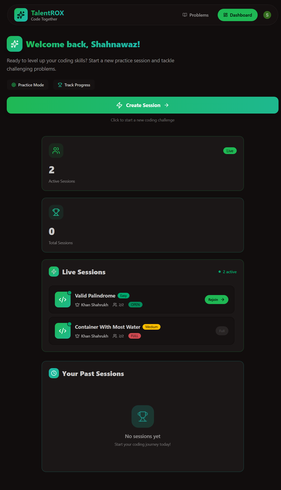
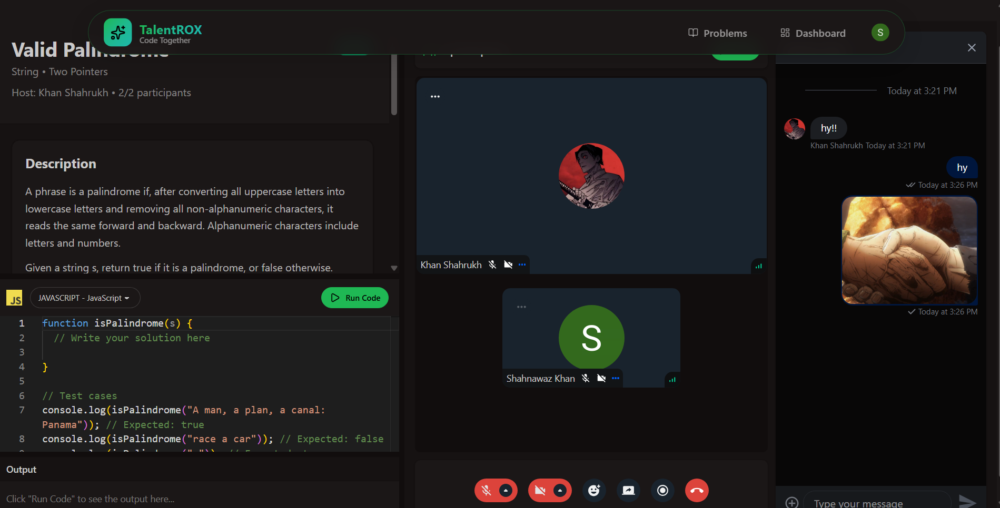
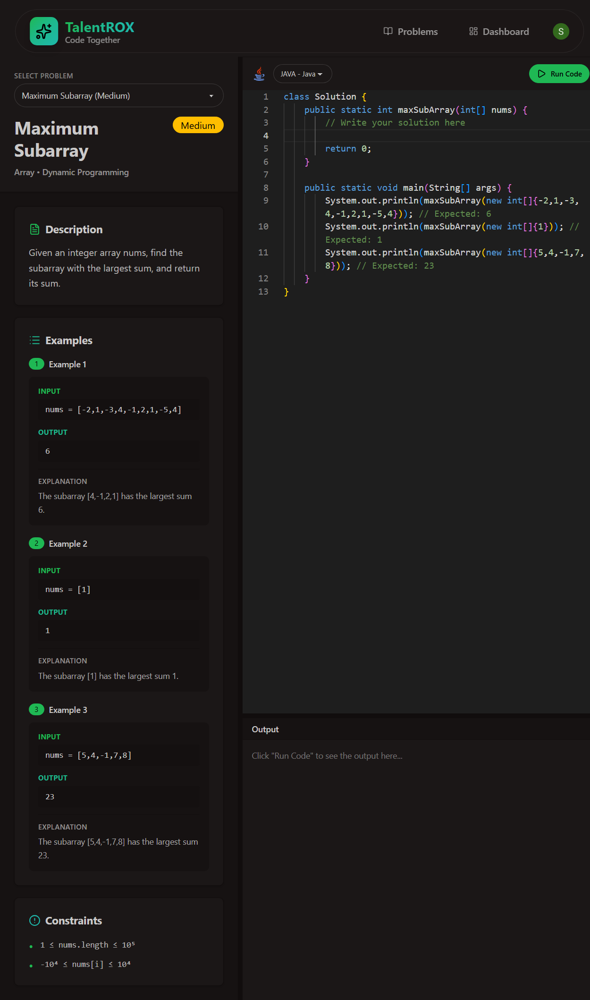

# TalentROX — Video Calling Interview Platform

<div align="center">


**A real-time collaborative technical interview platform with video calling, live code editing, and session management.**

[](https://nodejs.org)
[](https://react.dev)
[](https://mongodb.com)
[](https://expressjs.com)

</div>

---

## 📋 Table of Contents

- [Overview](#overview)
- [Features](#features)
- [Tech Stack](#tech-stack)
- [Project Structure](#project-structure)
- [Getting Started](#getting-started)
- [Environment Variables](#environment-variables)
- [API Endpoints](#api-endpoints)
- [Available Problems](#available-problems)
- [Screenshots](#screenshots)

---

## 🚀 Overview

TalentROX is a full-stack technical interview platform that allows developers to conduct and participate in live coding sessions. Hosts can create sessions for specific LeetCode-style problems, participants can join in real-time, write code together, run it against test cases, and collaborate over video/chat — all in one place.

The platform integrates:

- **Clerk** for authentication
- **Stream** for video calls and chat
- **Inngest** for background jobs (user sync)
- **JDoodle API** for sandboxed code execution

---

## ✨ Features

- 🔐 **Authentication** — Secure sign-up/sign-in via Clerk
- 🎥 **Video Calls** — HD real-time video using Stream Video SDK
- 💬 **Live Chat** — In-session messaging via Stream Chat
- 🧩 **Collaborative Code Editor** — Monaco Editor with multi-language support (JavaScript, Python, Java)
- ▶️ **Code Execution** — Run code in-browser via the JDoodle API
- 📋 **Session Management** — Create, join, and end coding sessions
- 🏆 **Problem Library** — Curated DSA problems with difficulty levels
- 📊 **Dashboard** — View active sessions and past session history
- 🎊 **Confetti Celebration** — Triggers when all test cases pass
- 📱 **Responsive UI** — Mobile-friendly layout with DaisyUI + Tailwind CSS

---

## 🛠 Tech Stack

### Frontend

| Technology             | Purpose                 |
| ---------------------- | ----------------------- |
| React 19               | UI framework            |
| Vite                   | Build tool              |
| Tailwind CSS v4        | Styling                 |
| DaisyUI v5             | Component library       |
| React Router v7        | Client-side routing     |
| TanStack Query v5      | Server state management |
| Clerk React            | Authentication UI       |
| Stream Video React SDK | Video calling           |
| Stream Chat React      | Chat interface          |
| Monaco Editor          | Code editor             |
| React Resizable Panels | Resizable layout        |
| Axios                  | HTTP client             |
| canvas-confetti        | Celebration effects     |

### Backend

| Technology         | Purpose                   |
| ------------------ | ------------------------- |
| Node.js 20+        | Runtime                   |
| Express 5          | Web framework             |
| MongoDB + Mongoose | Database                  |
| Clerk Express      | Auth middleware           |
| Stream Chat SDK    | Chat management           |
| Stream Node SDK    | Video call management     |
| Inngest            | Background job processing |
| dotenv             | Environment config        |

---

## 🏁 Getting Started

### Prerequisites

- Node.js 20+
- MongoDB (local or Atlas)
- Accounts for: [Clerk](https://clerk.com), [Stream](https://getstream.io), [Inngest](https://inngest.com)

### 1. Clone the repository

```bash
git clone https://github.com/shahnawaz-codes/Video-Calling-Interview-Platform.git
cd Video-Calling-Interview-Platform
```

### 2. Install dependencies

```bash
# Install frontend dependencies
cd frontend && npm install

# Install backend dependencies
cd ../backend && npm install
```

### 3. Configure environment variables

Create `.env` files as described in the [Environment Variables](#environment-variables) section below.

### 4. Run in development

```bash
# Start backend (from /backend)
npm run dev

# Start frontend (from /frontend)
npm run dev
```

The frontend will be available at `http://localhost:5173` and the backend at `http://localhost:3000`.

### 5. Production build

```bash
# From root
npm run build
npm start
```

---

## 🔐 Environment Variables

### Backend (`backend/.env`)

```env
PORT=3000
MONGODB_URI=mongodb://localhost:27017/talentrox
NODE_ENV=development
CLIENT_URL=http://localhost:5173

# Clerk
CLERK_PUBLISHABLE_KEY=pk_test_...
CLERK_SECRET_KEY=sk_test_...

# Stream
STREAM_API_KEY=your_stream_api_key
STREAM_API_SECRET=your_stream_api_secret

# Inngest
INNGEST_API_KEY=your_inngest_api_key
INNGEST_SIGNING_KEY=your_inngest_signing_key
```

### Frontend (`frontend/.env`)

```env
VITE_CLERK_PUBLISHABLE_KEY=pk_test_...
VITE_BACKEND_URL=http://localhost:3000/api
```

---

## 📡 API Endpoints

### Authentication

All protected routes require a valid Clerk session token.

### Session Routes (`/api/session`)

| Method | Endpoint           | Description                           | Auth |
| ------ | ------------------ | ------------------------------------- | ---- |
| `POST` | `/`                | Create a new session                  | ✅   |
| `GET`  | `/active`          | Get all active sessions               | ✅   |
| `GET`  | `/my-recent`       | Get current user's completed sessions | ✅   |
| `GET`  | `/:sessionId`      | Get session by ID                     | ✅   |
| `POST` | `/:sessionId/join` | Join a session as participant         | ✅   |
| `POST` | `/:sessionId/end`  | End session (host only)               | ✅   |

### Chat Routes (`/api/chat`)

| Method | Endpoint        | Description                            | Auth |
| ------ | --------------- | -------------------------------------- | ---- |
| `GET`  | `/stream-token` | Get Stream chat token for current user | ✅   |

### Inngest (`/api/inngest`)

Handles Clerk webhooks for user lifecycle events:

- `clerk/user.created` → Creates user in MongoDB + Stream
- `clerk/user.deleted` → Removes user from MongoDB + Stream

---

## 📚 Available Problems

| #   | Title                     | Difficulty | Category                   |
| --- | ------------------------- | ---------- | -------------------------- |
| 1   | Two Sum                   | Easy       | Array, Hash Table          |
| 2   | Reverse String            | Easy       | String, Two Pointers       |
| 3   | Valid Palindrome          | Easy       | String, Two Pointers       |
| 4   | Maximum Subarray          | Medium     | Array, Dynamic Programming |
| 5   | Container With Most Water | Medium     | Array, Two Pointers        |

Each problem includes:

- Problem description with examples and constraints
- Starter code for JavaScript, Python, and Java
- Expected output for automated test validation

---

## 🔄 How It Works

```
1. User signs up via Clerk
        ↓
2. Clerk webhook fires → Inngest syncs user to MongoDB + Stream
        ↓
3. Host creates a session (problem + difficulty)
        ↓
4. Stream video call + chat channel created automatically
        ↓
5. Participant joins via dashboard → added to Stream channel
        ↓
6. Both users code in Monaco Editor, run code via JDoodle API
        ↓
7. Host ends session → Stream call/chat deleted, session marked completed
```

---

## 📸 Screenshots

### 🖥️ Dashboard



### 🎥 Video Call



### 💻 Session / Code Editor

## 

## 🤝 Contributing

1. Fork the repository
2. Create a feature branch: `git checkout -b feature/your-feature`
3. Commit your changes: `git commit -m 'Add your feature'`
4. Push to the branch: `git push origin feature/your-feature`
5. Open a Pull Request

---

## 📄 License

This project is licensed under the ISC License.

---

<div align="center">
  Made with ❤️ by <a href="https://github.com/shahnawaz-codes">Shahnawaz Khan</a>
</div>
