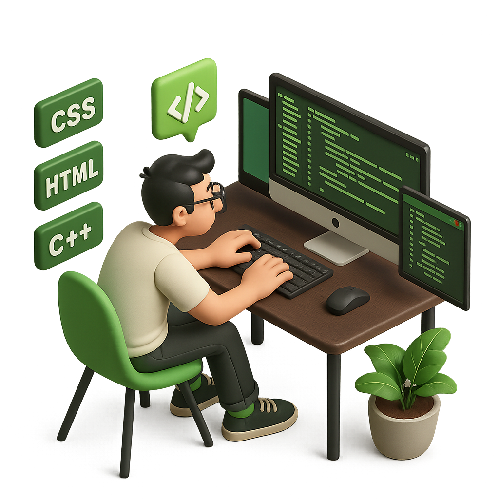
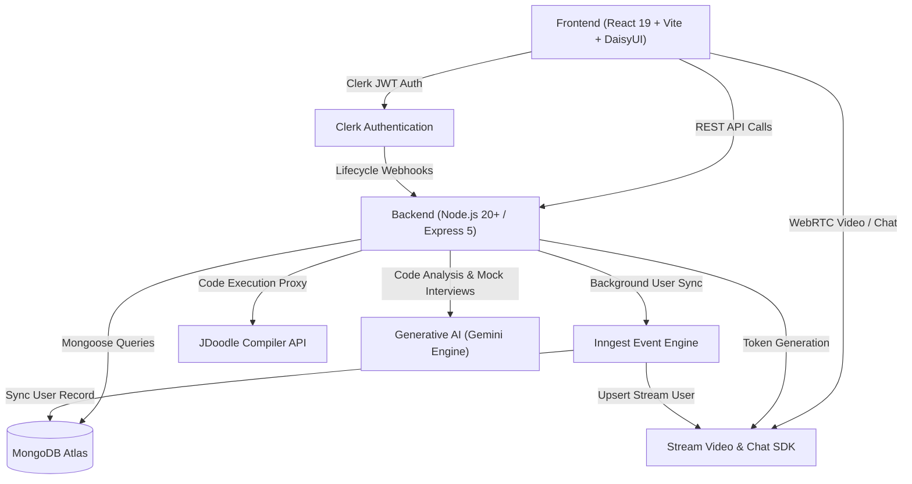
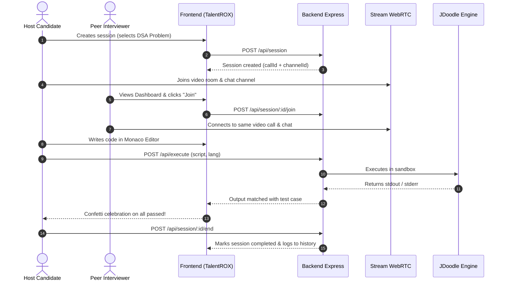
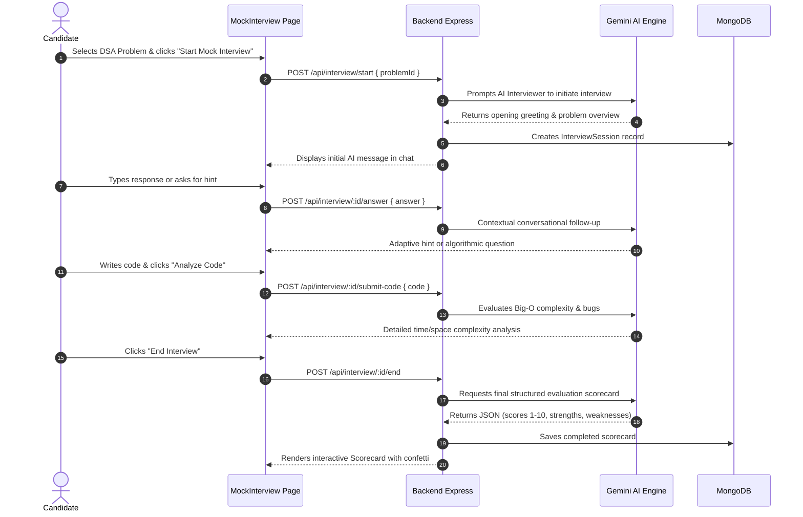
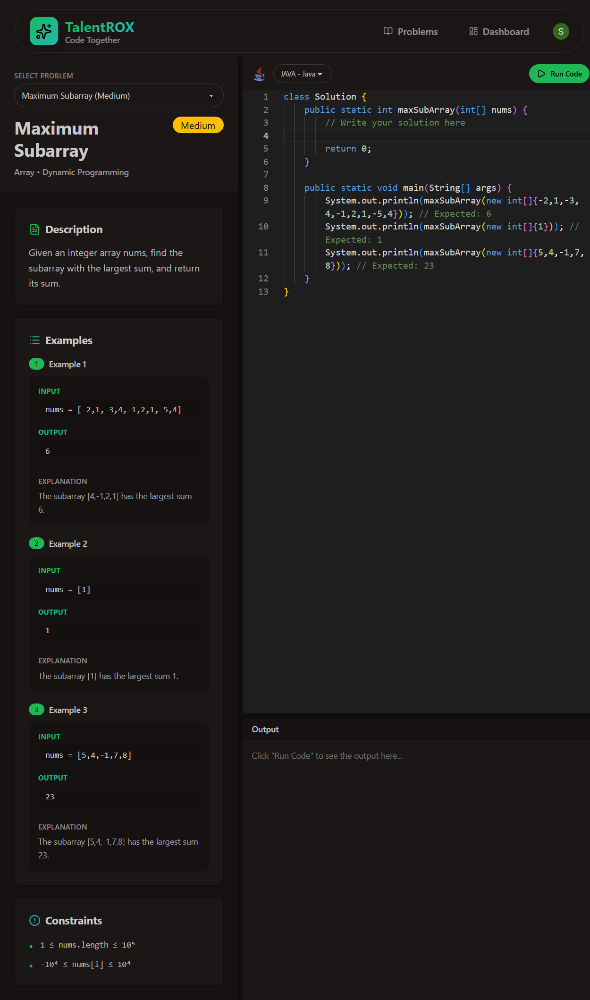
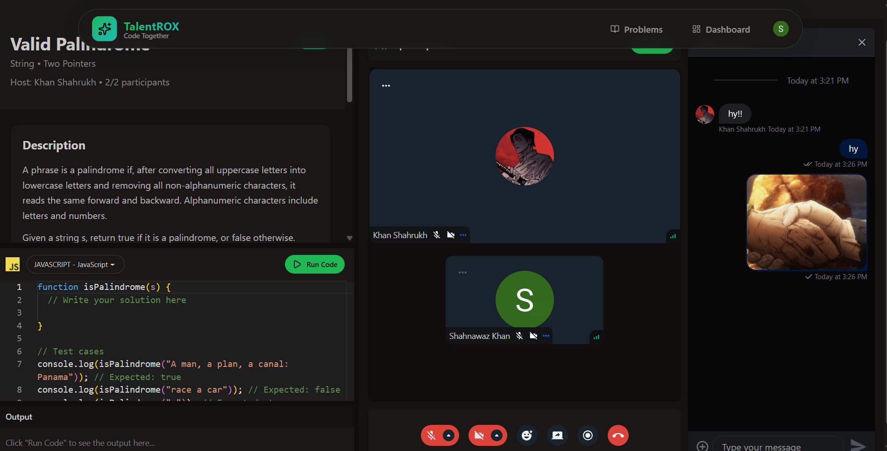
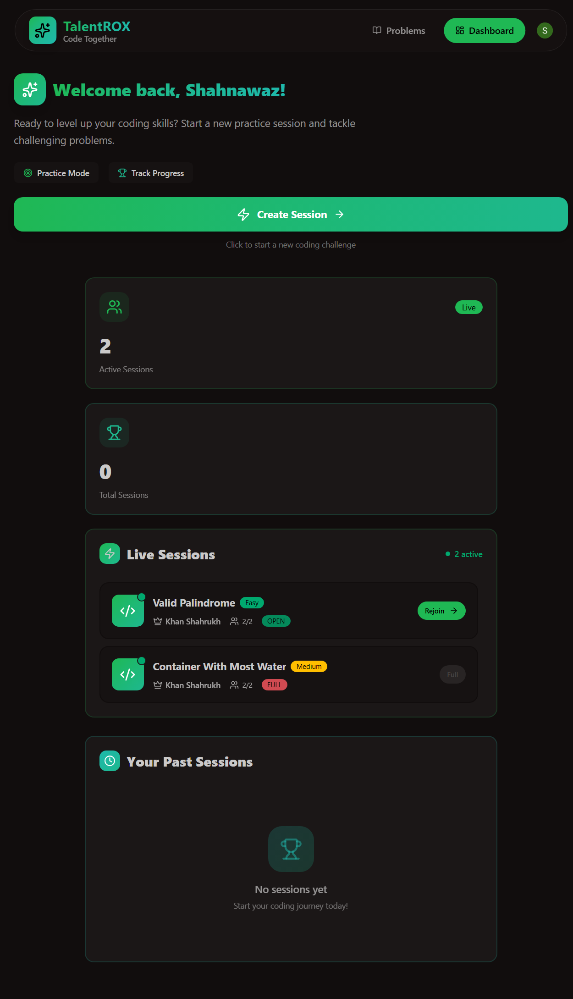

# TalentROX — Collaborative Video Calling & AI Technical Interview Platform

<div align="center">



**A full-stack technical interview platform combining real-time 1-on-1 video coding rooms with an intelligent AI mock interviewer, sandboxed code execution, and comprehensive performance scorecards.**

[](https://react.dev)
[](https://vitejs.dev)
[](https://nodejs.org)
[](https://expressjs.com)
[](https://mongodb.com)
[](https://tailwindcss.com)
[](https://daisyui.com)
[](https://clerk.com)
[](https://getstream.io)
[](https://ai.google.dev)

</div>

---

## 📋 Table of Contents

- [Overview](#-overview)
- [Key Features](#-key-features)
- [Platform Architecture](#-platform-architecture)
- [Interactive Workflows](#-interactive-workflows)
- [Tech Stack](#-tech-stack)
- [Project Structure](#-project-structure)
- [Available Problem Bank](#-available-problem-bank)
- [API Endpoints Reference](#-api-endpoints-reference)
- [Getting Started](#-getting-started)
- [Environment Variables](#-environment-variables)
- [Screenshots & Visual Tour](#-screenshots--visual-tour)
- [Contributing](#-contributing)
- [License](#-license)

---

## 🚀 Overview

**TalentROX** is an end-to-end technical interview preparation and assessment platform designed for engineers, candidates, and interviewers. It offers two distinct modes:

1. **👥 1-on-1 Live Peer Technical Interviewing**:
   - Host generates a room choosing from curated LeetCode-style DSA challenges.
   - Peer connects seamlessly from the active room dashboard.
   - Real-time HD WebRTC video calling and in-session text chat.
   - Monaco Code Editor supporting **JavaScript**, **Python**, and **Java**.
   - Sandboxed execution via JDoodle API with automated test case evaluation.

2. **🤖 Solo AI Mock Interviewer**:
   - Dynamic, conversational technical interviews guided by Generative AI.
   - Probing algorithmic questions, approach critique, and progressive hints.
   - One-click Big-O Time & Space complexity analysis and unhandled edge case detection.
   - Rigorous post-interview evaluation report with a **1-10 scorecard**, strengths, weaknesses, and concrete optimization paths.

---

## ✨ Key Features

### 🤖 1. AI-Powered Mock Interviews & Live Dialogue
- **Interactive Technical Interviewer**: Welcomes the candidate, sets problem expectations, and guides discussions without giving away solutions prematurely.
- **Adaptive Hint System**: Progressive hints that guide candidates towards optimal time/space complexity when stuck.
- **Comprehensive Scorecards**: Multi-category breakdown scoring:
  - Overall Score (1-10)
  - Problem Solving & Logic
  - Technical Correctness
  - Code Quality & Cleanliness
  - Communication & Reasoning
  - Asymptotic Efficiency (Big-O Time & Space)

### ⚡ 2. Instant AI Code Complexity & Bug Analysis
- **One-Click Audit**: Submit written code directly to the AI analyzer.
- **Big-O Notation**: Precise evaluation of Time Complexity (e.g., $O(n)$) and Space Complexity (e.g., $O(1)$) with reasoning.
- **Edge-Case & Bug Discovery**: Automatic detection of off-by-one errors, empty arrays, null pointer issues, and performance bottlenecks.

### 🎥 3. HD Video Calling & Media Controls
- Powered by the **Stream Video SDK** over WebRTC for crystal-clear, ultra-low latency audio/video.
- Fast camera toggle, microphone mute/unmute, and leave-call handling.
- Integrated directly alongside the coding workspace in a flexible resizable panel.

### 💬 4. In-Session Real-Time Chat
- Built with **Stream Chat React SDK** for in-room communication.
- Share custom test cases, edge scenarios, links, and notes without talking over the interviewer.

### 💻 5. Monaco Code Editor & Sandboxed Compilation
- VS Code-grade Monaco Editor with syntax highlighting, automatic layout, line numbers, and dark mode.
- Language switching between **JavaScript**, **Python**, and **Java**.
- Remote code execution through the **JDoodle API** proxy.
- Real-time output display, comparison against expected outputs, and confetti celebration effects (`canvas-confetti`) when test cases pass.

### 📚 6. Curated DSA Problem Bank
- Hand-picked technical interview challenges with difficulty tiers (`Easy`, `Medium`).
- Comprehensive problem statement, detailed examples, constraints, starter templates, and verified test suites.

### 📊 7. Dashboard & Session Management
- Real-time display of currently **Active Sessions** that peers can join instantly.
- **Recent Sessions History** tracking completed interviews and session durations.
- One-click session creation modal with problem selection and difficulty configuration.

### 🔐 8. Enterprise-Grade Authentication & Webhook Sync
- Seamless authentication with **Clerk** (sign in, sign up, session management).
- Asynchronous background synchronization via **Inngest** webhooks (`clerk/user.created`, `clerk/user.deleted`) to maintain user state in MongoDB and Stream.
- Express rate-limiters on AI endpoints to prevent abuse.

---

## 🏗 Platform Architecture


```mermaid
graph TD
    Client["Frontend (React 19 + Vite + DaisyUI)"]
    Server["Backend (Node.js 20+ / Express 5)"]
    DB[(MongoDB Atlas)]
    Clerk["Clerk Authentication"]
    Stream["Stream Video & Chat SDK"]
    Inngest["Inngest Event Engine"]
    JDoodle["JDoodle Compiler API"]
    AI["Generative AI (Gemini Engine)"]

    Client -->|Clerk JWT Auth| Clerk
    Client -->|WebRTC Video / Chat| Stream
    Client -->|REST API Calls| Server
    Server -->|Mongoose Queries| DB
    Server -->|Token Generation| Stream
    Server -->|Code Execution Proxy| JDoodle
    Server -->|Code Analysis & Mock Interviews| AI
    Clerk -->|Lifecycle Webhooks| Server
    Server -->|Background User Sync| Inngest
    Inngest -->|Sync User Record| DB
    Inngest -->|Upsert Stream User| Stream
```

---

## 🔄 Interactive Workflows

### Workflow A: 1-on-1 Peer Video Interview


```mermaid
sequenceDiagram
    autonumber
    actor Host as Host Candidate
    actor Peer as Peer Interviewer
    participant Client as Frontend (TalentROX)
    participant Server as Backend Express
    participant Stream as Stream WebRTC
    participant JDoodle as JDoodle Engine

    Host->>Client: Creates session (selects DSA Problem)
    Client->>Server: POST /api/session
    Server-->>Client: Session created (callId + channelId)
    Host->>Stream: Joins video room & chat channel
    Peer->>Client: Views Dashboard & clicks "Join"
    Client->>Server: POST /api/session/:id/join
    Peer->>Stream: Connects to same video call & chat
    Host->>Client: Writes code in Monaco Editor
    Host->>Server: POST /api/execute (script, lang)
    Server->>JDoodle: Executes in sandbox
    JDoodle-->>Server: Returns stdout / stderr
    Server-->>Client: Output matched with test case
    Client-->>Host: Confetti celebration on all passed!
    Host->>Server: POST /api/session/:id/end
    Server-->>Client: Marks session completed & logs to history
```

### Workflow B: Solo AI Mock Interview & Evaluation


```mermaid
sequenceDiagram
    autonumber
    actor User as Candidate
    participant UI as MockInterview Page
    participant API as Backend Express
    participant AI as Gemini AI Engine
    participant DB as MongoDB

    User->>UI: Selects DSA Problem & clicks "Start Mock Interview"
    UI->>API: POST /api/interview/start { problemId }
    API->>AI: Prompts AI Interviewer to initiate interview
    AI-->>API: Returns opening greeting & problem overview
    API->>DB: Creates InterviewSession record
    API-->>UI: Displays initial AI message in chat
    User->>UI: Types response or asks for hint
    UI->>API: POST /api/interview/:id/answer { answer }
    API->>AI: Contextual conversational follow-up
    AI-->>UI: Adaptive hint or algorithmic question
    User->>UI: Writes code & clicks "Analyze Code"
    UI->>API: POST /api/interview/:id/submit-code { code }
    API->>AI: Evaluates Big-O complexity & bugs
    AI-->>UI: Detailed time/space complexity analysis
    User->>UI: Clicks "End Interview"
    UI->>API: POST /api/interview/:id/end
    API->>AI: Requests final structured evaluation scorecard
    AI-->>API: Returns JSON (scores 1-10, strengths, weaknesses)
    API->>DB: Saves completed scorecard
    API-->>UI: Renders interactive Scorecard with confetti
```

---

## 🛠 Tech Stack

### Frontend
| Technology | Version | Purpose |
| :--- | :--- | :--- |
| **React** | `^19.2.0` | UI framework and state reactivity |
| **Vite** | `^7.2.6` | Next-generation frontend build tool and dev server |
| **Tailwind CSS** | `^4.1.17` | Utility-first styling engine |
| **DaisyUI** | `^5.5.8` | UI component system (`forest` default theme) |
| **React Router** | `^7.10.1` | Client-side routing with layout outlets |
| **TanStack Query** | `^5.90.21` | Server state management, caching, and mutations |
| **Clerk React** | `^5.57.0` | Authentication UI modals and session tokens |
| **Stream Video React SDK** | `^1.24.0` | HD WebRTC video calling and device toggles |
| **Stream Chat React** | `^13.9.0` | Real-time in-session chat channel |
| **Monaco Editor** | `^4.7.0` | Full-featured code editor with syntax highlighting |
| **React Resizable Panels** | `^3.0.6` | Split-view panels for editor, video, and problem view |
| **Canvas Confetti** | `^1.9.4` | Visual celebration upon passing all test cases |
| **Lucide React** | `^0.556.0` | Modern, clean vector iconography |

### Backend
| Technology | Version | Purpose |
| :--- | :--- | :--- |
| **Node.js** | `20+` | JavaScript runtime environment |
| **Express** | `^5.0.0` | Web framework handling REST routes and middleware |
| **MongoDB + Mongoose** | `^9.0.0` | NoSQL database for users, sessions, and scorecards |
| **Clerk Express** | `^1.7.0` | JWT verification and user authorization middleware |
| **Stream Node SDK** | `^0.5.0` | Server-side Stream video call management |
| **Stream Chat SDK** | `^9.23.0` | Server-side user token generation and channel control |
| **Inngest** | `^3.33.0` | Event-driven serverless background user synchronization |
| **Google Generative AI** | REST / Axios | LLM engine driving mock interviews and Big-O audits |
| **JDoodle API** | REST / Axios | Sandboxed remote code compilation and test evaluation |
| **Express Rate Limit** | `^7.5.0` | Throttling protection on AI and code submission routes |
| **CORS** | `^2.8.5` | Secure cross-origin resource sharing configuration |
| **Dotenv** | `^16.4.7` | Environment variable management |

---

## 📂 Project Structure

```
Video-Calling-Interview-Platform/
├── frontend/                         # Client-side React application
│   ├── public/
│   │   ├── images/
│   │   │   ├── hero.png              # Landing page hero mockup
│   │   │   ├── javascript.png        # Language logo
│   │   │   ├── python.png            # Language logo
│   │   │   ├── java.png              # Language logo
│   │   │   └── screenshots/          # Platform tour screenshots
│   │   │       ├── session.png       # Editor & workspace view
│   │   │       ├── video-call.png    # Live WebRTC video room
│   │   │       └── dashboard.png     # Active & recent sessions
│   ├── src/
│   │   ├── api/                      # Axios HTTP client endpoints
│   │   │   ├── interviewApi.js       # AI mock interview REST client
│   │   │   └── sessionApi.js         # Video session REST client
│   │   ├── components/               # Modular UI components
│   │   │   ├── AIAnalysisResults.jsx # Big-O & code complexity modal
│   │   │   ├── ActiveSessions.jsx    # Dashboard active rooms list
│   │   │   ├── CodeEditorPanel.jsx   # Monaco code editor wrapper
│   │   │   ├── CreateSessionModal.jsx# Session creation dialog
│   │   │   ├── InterviewChatPanel.jsx# Live AI conversation panel
│   │   │   ├── InterviewScorecard.jsx# 1-10 evaluation results view
│   │   │   ├── Navbar.jsx            # Main authenticated navigation
│   │   │   ├── OutputPanel.jsx       # Terminal stdout output panel
│   │   │   ├── ProblemDescription.jsx# DSA problem specification view
│   │   │   ├── ProtectedRoute.jsx    # Clerk auth guard
│   │   │   ├── RecentSessions.jsx    # Completed session history table
│   │   │   ├── StatsCards.jsx        # Dashboard counters
│   │   │   ├── VideoCallUI.jsx       # Stream video call overlay & controls
│   │   │   └── WelcomeSection.jsx    # Dashboard header banner
│   │   ├── data/
│   │   │   ├── language.js           # JDoodle language versions index
│   │   │   └── problems.js           # Curated DSA problem bank
│   │   ├── hooks/                    # Custom React & TanStack query hooks
│   │   │   ├── useAnalyzeCode.js     # Hook for AI complexity analysis
│   │   │   ├── useExecuteCode.js     # Hook for JDoodle code execution
│   │   │   ├── useSessions.js        # React Query hooks for sessions
│   │   │   └── useStreamClient.js    # Stream Video & Chat lifecycle hook
│   │   ├── lib/
│   │   │   ├── stream.js             # Stream client initialization
│   │   │   └── utils.js              # Output normalization & confetti helper
│   │   ├── pages/
│   │   │   ├── Dashboard.jsx         # User dashboard overview
│   │   │   ├── Home.jsx              # Landing page with platform tour
│   │   │   ├── MockInterview.jsx     # AI Mock Interview workspace
│   │   │   ├── Problem.jsx           # Solo problem solver
│   │   │   ├── Problems.jsx          # DSA problem catalogue
│   │   │   └── Session.jsx           # 1-on-1 Peer Video Calling workspace
│   │   ├── App.jsx                   # App root with Clerk auth & Toaster
│   │   ├── index.css                 # Tailwind CSS v4 & DaisyUI forest theme
│   │   ├── main.jsx                  # React DOM root & providers
│   │   └── router.jsx                # React Router v7 route definitions
│   ├── .env.example                  # Client environment variable template
│   ├── package.json
│   └── vite.config.js
│
├── backend/                          # Server-side Express application
│   ├── src/
│   │   ├── controllers/
│   │   │   ├── chatController.js     # Stream chat token controller
│   │   │   ├── interviewController.js# AI mock interview state machine
│   │   │   └── sessionController.js  # Video room lifecycle controller
│   │   ├── lib/
│   │   │   ├── db.js                 # MongoDB Mongoose connection
│   │   │   ├── env.js                # Environment variable validation
│   │   │   ├── gemini.js             # Generative AI prompts & schemas
│   │   │   ├── inngest.js            # Inngest webhook user synchronization
│   │   │   └── stream.js             # Stream server client instance
│   │   ├── midleware/
│   │   │   ├── errorHandler.js       # Global error handler
│   │   │   ├── protectedRoute.js     # Clerk auth enforcement
│   │   │   └── rateLimiter.js        # Express rate limiting
│   │   ├── model/
│   │   │   ├── InterviewSession.js   # Mongoose schema for AI interviews
│   │   │   ├── Session.js            # Mongoose schema for 1-on-1 rooms
│   │   │   └── User.js               # Mongoose schema for synced users
│   │   ├── routes/
│   │   │   ├── analyzeRoute.js       # /api/analyze-code routes
│   │   │   ├── chatRoute.js          # /api/chat routes
│   │   │   ├── compilerRoute.js      # /api/execute (JDoodle proxy)
│   │   │   ├── interviewRoute.js     # /api/interview routes
│   │   │   └── sessionRoute.js       # /api/session routes
│   │   └── index.js                  # Express app entry & HTTP server
│   ├── .env.example                  # Server environment variable template
│   └── package.json
│
└── README.md                         # Main documentation
```

---

## 📚 Available Problem Bank

| # | Title | Difficulty | Category | Supported Languages |
| :-: | :--- | :-: | :--- | :-: |
| **1** | Two Sum | `Easy` | Array • Hash Table | JavaScript, Python, Java |
| **2** | Reverse String | `Easy` | String • Two Pointers | JavaScript, Python, Java |
| **3** | Valid Palindrome | `Easy` | String • Two Pointers | JavaScript, Python, Java |
| **4** | Maximum Subarray | `Medium` | Array • Dynamic Programming | JavaScript, Python, Java |
| **5** | Container With Most Water | `Medium` | Array • Two Pointers | JavaScript, Python, Java |

> Each challenge includes starter code templates, constraint definitions, multiple sample test cases, and verified outputs.

---

## 📡 API Endpoints Reference

All protected endpoints require a valid Clerk Bearer JWT token in the `Authorization` header (`Bearer <token>`).

### 1. Peer Video Session Routes (`/api/session`)
| Method | Endpoint | Description | Auth Required |
| :--- | :--- | :--- | :---: |
| `POST` | `/api/session` | Create a new 1-on-1 interview session | ✅ |
| `GET` | `/api/session/active` | Retrieve all currently open sessions | ✅ |
| `GET` | `/api/session/my-recent` | Get current user's completed sessions | ✅ |
| `GET` | `/api/session/:sessionId` | Retrieve session details by ID | ✅ |
| `POST` | `/api/session/:sessionId/join` | Join session as participant | ✅ |
| `POST` | `/api/session/:sessionId/end` | Terminate session (host only) | ✅ |

### 2. AI Mock Interview Routes (`/api/interview`)
| Method | Endpoint | Description | Auth Required |
| :--- | :--- | :--- | :---: |
| `POST` | `/api/interview/start` | Start or resume an AI mock interview session | ✅ |
| `GET` | `/api/interview/:sessionId` | Get AI interview session state & history | ✅ |
| `POST` | `/api/interview/:sessionId/submit-code` | Submit code for Big-O analysis & audit | ✅ |
| `POST` | `/api/interview/:sessionId/answer` | Send a response/question to the AI interviewer | ✅ |
| `POST` | `/api/interview/:sessionId/end` | End interview and generate 1-10 scorecard | ✅ |

### 3. Code Analysis & Compiler Routes
| Method | Endpoint | Description | Auth Required |
| :--- | :--- | :--- | :---: |
| `POST` | `/api/analyze-code` | Standalone AI code complexity audit | ✅ |
| `POST` | `/api/execute` | Sandboxed code execution via JDoodle | ❌ |

### 4. Chat & Webhook Routes
| Method | Endpoint | Description | Auth Required |
| :--- | :--- | :--- | :---: |
| `GET` | `/api/chat/stream-token` | Generate Stream user token | ✅ |
| `ALL` | `/api/inngest` | Inngest event processor for Clerk sync | ❌ |

---

## 🏁 Getting Started

### Prerequisites

Make sure you have installed:
- [Node.js](https://nodejs.org) (v20 or higher)
- [npm](https://npmjs.com) (v10 or higher)
- [MongoDB](https://www.mongodb.com/) (Local instance or MongoDB Atlas cluster)

Accounts and API keys required:
- [Clerk](https://clerk.com) — User authentication
- [Stream](https://getstream.io) — Video calling & chat SDK
- [Inngest](https://inngest.com) — Event-driven background jobs
- [JDoodle](https://www.jdoodle.com/compiler-api/) — Sandboxed compiler
- [Google AI Studio (Gemini)](https://aistudio.google.com/) — Generative AI engine

---

### Step 1: Clone the Repository

```bash
git clone https://github.com/shahnawaz-codes/Video-Calling-Interview-Platform.git
cd Video-Calling-Interview-Platform
```

---

### Step 2: Install Dependencies

```bash
# Install frontend dependencies
cd frontend
npm install

# Install backend dependencies
cd ../backend
npm install
```

---

### Step 3: Configure Environment Variables

Create `.env` files in both `frontend` and `backend` directories using the provided templates:

#### Backend Config (`backend/.env`):
```env
PORT=3000
NODE_ENV=development
MONGODB_URI=mongodb+srv://<username>:<password>@cluster.mongodb.net/talentrox
CLIENT_URL=http://localhost:5173

# Clerk Authentication
CLERK_PUBLISHABLE_KEY=pk_test_...
CLERK_SECRET_KEY=sk_test_...

# Stream Video & Chat
STREAM_API_KEY=your_stream_api_key
STREAM_API_SECRET=your_stream_api_secret

# Inngest Background Jobs
INNGEST_API_KEY=your_inngest_api_key
INNGEST_SIGNING_KEY=signkey-prod-...

# JDoodle Code Execution API
JDOODLE_CLIENT_ID=your_jdoodle_client_id
JDOODLE_CLIENT_SECRET=your_jdoodle_client_secret

# Generative AI API Key
GEMINI_API_KEY=your_gemini_api_key
```

#### Frontend Config (`frontend/.env`):
```env
VITE_CLERK_PUBLISHABLE_KEY=pk_test_...
VITE_BACKEND_URL=http://localhost:3000/api
VITE_STREAM_API_KEY=your_stream_api_key
```

---

### Step 4: Run the Application Locally

Run the backend and frontend in separate terminals:

```bash
# Terminal 1 — Start Backend Server
cd backend
npm run dev

# Terminal 2 — Start Frontend Vite Client
cd frontend
npm run dev
```

* **Frontend Client**: `http://localhost:5173`
* **Backend API Server**: `http://localhost:3000`

---

### Step 5: Production Build

```bash
# Build frontend bundle
cd frontend
npm run build

# Start backend serving the compiled frontend
cd ../backend
npm start
```

---

## 📸 Screenshots & Visual Tour

### 🖥️ 1. Interactive Workspace (Monaco Editor + JDoodle Execution)


### 🎥 2. Live Peer Video Calling & Real-Time Chat


### 📊 3. Active Rooms & Interview History Dashboard


---

## 🤝 Contributing

Contributions, issues, and feature requests are welcome!

1. Fork the Project.
2. Create your Feature Branch (`git checkout -b feature/AmazingFeature`).
3. Commit your Changes (`git commit -m 'Add some AmazingFeature'`).
4. Push to the Branch (`git push origin feature/AmazingFeature`).
5. Open a Pull Request.

---

## 📄 License

This project is licensed under the **ISC License**.

---

<div align="center">

Built with ❤️ by **[Shahnawaz Khan](https://github.com/shahnawaz-codes)**

</div>
